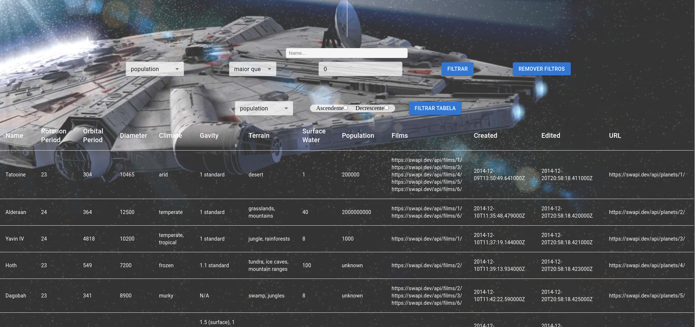

# :earth_americas: Starwars Planets! :earth_asia:

 

# :camera_flash: Imagens do Projeto

  
  

 

# :clipboard: About
Projeto Desenvolvido durante o curso da Trybe com foco no desenvolvimento de filtros, utilizando Context API para conectar os componentes. O projeto se trata de 
uma tabela de planetas do mundo de Star Wars com diversas informaçoes sobre cada um, podendo utilizar de diversos filtros para apresentar apenas os que corresponderem.

 

# :hammer_and_wrench: Skills & Tools

- HTML5
- CSS3
- JavaScript ES6+
- React.js
- React Testing Library / Jest
- Context API
- API
- Material UI

 

# :scroll: Nota

 
 
# :construction: To Implement :construction:

- CSS Responsivo & Mobile
